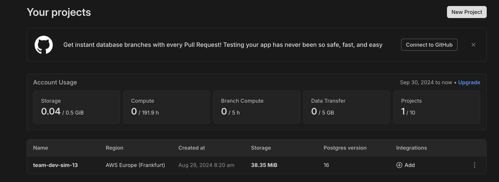
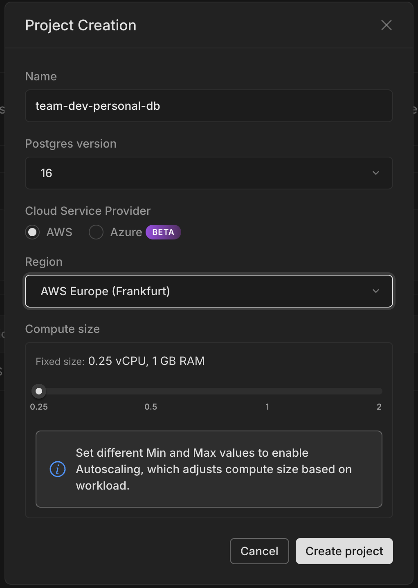
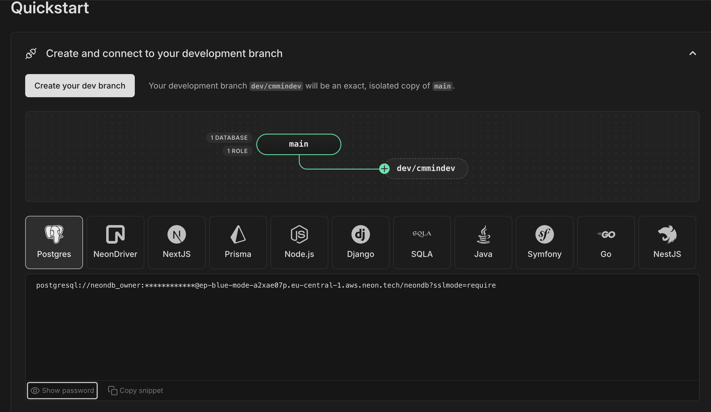

# Setting up a local database

## Hosted DB on Neon

1. [Sign in to Neon](https://neon.tech) using your GitHub account (or an account you create via email or other forms of authentication)

   - If it asks you to create a team, create one with any name

2. When logged in, click `Create new project`
   

3. Enter a name for your new database instance, choose PG 16, AWS hosting and the minimal size for the DB. **This will be your PRIMARY database**
   

4. Repeat the same steps to create a second database, this time give it the same name but add `-shadow` to the end. **This will be your SHADOW database**

5. Copy the DB Connection strings for each database. a) open the Database Project; b) visit the `Quickstart` page; c) Click `Posgres` and then click `Copy snippet`
   

6. In your `.env` file, paste the connection strings, making sure you keep the `?sslmode=require&schema=prisma` and `?sslmode=require&schema=shadow` at the end of the connection string.

## Local DB via Docker

See Docker's [official guide](https://www.docker.com/blog/how-to-use-the-postgres-docker-official-image/) on using the Postgres Docker image.
